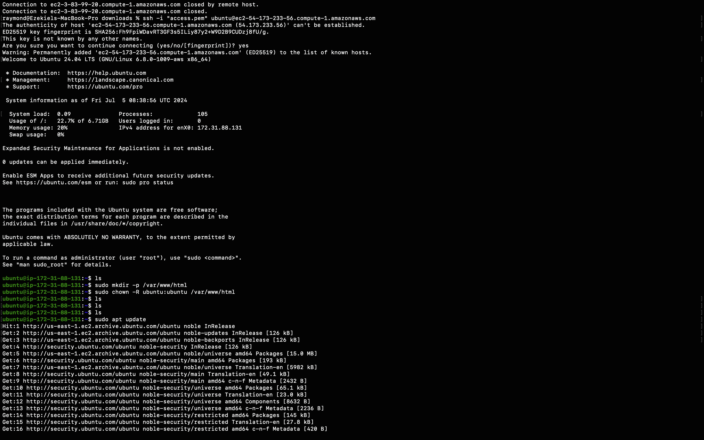

# Static Website Deployment on AWS EC2 with Apache

This project demonstrates the deployment of a static website on an AWS EC2 instance using Apache as the web server. The website includes personal information such as my name, username, and email and mentions the HNG Internship.

## Table of Contents

* [Project Overview](#project-overview)
* [Requirements](#requirements)
* [Setup Instructions](#setup-instructions)
  * [Step 1: Launch EC2 Instance](#step-1-launch-ec2-instance)
  * [Step 2: Connect to EC2 Instance](#step-2-connect-to-ec2-instance)
  * [Step 3: Install Apache](#step-3-install-apache)
  * [Step 4: Configure Apache](#step-4-configure-apache)
  * [Step 5: Copy Website Files](#step-5-copy-website-files)
* [Verify Deployment](#verify-deployment)
* [Troubleshooting](#troubleshooting)
* [Author](#author)

## Project Overview

This project is part of the HNG Internship DevOps track. The task involves deploying a static website on a cloud platform using a web server. The static website should be accessible via a public IP address or domain name and must mention the HNG Internship.

## Requirements

* AWS Account
* SSH Key Pair for accessing the EC2 instance
* Static website files (HTML, CSS, JavaScript)

## Setup Instructions

### Step 1: Launch EC2 Instance

1. Log in to your AWS Management Console.
2. Navigate to the EC2 Dashboard.
3. Click on "Launch Instance".
4. Select the Ubuntu Server 20.04 LTS (HVM), SSD Volume Type AMI.
5. Choose an instance type (e.g., `t2.micro`).
6. Configure instance details and add storage if necessary.
7. Add a tag (optional).
8. Configure the security group:

   * Allow SSH (port 22) from your IP.
   * Allow HTTP (port 80) from anywhere.
9. Review and launch the instance.
10. Download the SSH key pair and save it securely.

### Step 2: Connect to EC2 Instance

1. Open your terminal.
2. Connect to the instance using SSH

   **ssh -i "access.pem" ubuntu@ec2-54-173-233-56.compute-1.amazonaws.com**

### Step 3: Install Apache

1. Update the package index:
   sudo apt update

2.Install Apache

sudo apt install apache2 -y

### Step 4: Configure Apache

1. Ensure the Apache service is running:
   <pre>

</pre>

sudo systemctl start apache2
sudo systemctl enable apache2

2. Create target directory:
   sudo mkdir -p /var/www/html
   sudo chown -R ubuntu:ubuntu /var/www/html

### Step 5: Copy Website Files

1. From your local machine, copy the website files to the EC2 instance

   **scp -i access.pem -r HNG ubuntu@54.173.233.56:/var/www/html/**

2.Adjust the permissions on the EC2 instance:

sudo chown -R www-data:www-data /var/www/html
sudo chmod -R 755 /var/www/html

Verify Deployment

1. Open your browser.
2. Navigate to http://54.173.233.56/HNG
